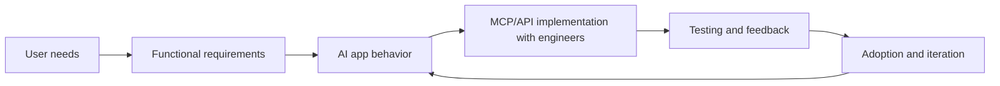

<h1 align="center">Ana Belen Garcia Caamano</h1>

  Business Analytics graduate building AI-powered workflows at the intersection of users, data, and engineering.

  
  
  

## Profile

I am a Business Analytics graduate with experience designing and delivering AI-powered solutions with business users and engineering teams.

My profile is functional-technical: I translate user needs into practical AI applications, define expected behavior, test solutions with stakeholders, and help teams iterate until the tool is useful in real work.

## What I Build

| Area | What I Focus On | Portfolio Evidence |
| --- | --- | --- |
| ChatGPT Apps | Conversational tools connected to enterprise workflows through MCP-style connectors and embedded widgets. | [Enterprise ChatGPT Apps Portfolio](https://github.com/anabelengarciac/enterprise-chatgpt-apps-showcase) |
| AI-assisted analytics | Reproducible workflows that combine data extraction, validation, enrichment, and business interpretation. | [Final Degree Project: AI Creative Analysis](https://github.com/anabelengarciac/spirits-ai-creative-analysis-tfg) |
| Reusable AI workflows | Practical assistants that automate recurring business tasks and make technical workflows easier to repeat. | [Repository Collection](https://github.com/anabelengarciac?tab=repositories) |
| Documentation governance | Tools that help teams keep project documentation structured, complete, and actionable. | [Project Docs Health Monitor](https://github.com/anabelengarciac/project-docs-health-monitor) |

## Featured Projects

### Enterprise ChatGPT Apps

An anonymized case study about building internal ChatGPT-based applications connected to business systems. It explains my role as the bridge between users and technical teams, including user discovery, testing, feedback sessions, and iteration.

[Open project](https://github.com/anabelengarciac/enterprise-chatgpt-apps-showcase)

### AI Creative Analysis Final Degree Project

A portfolio repository explaining my Bachelor's Thesis: an AI-assisted workflow for analyzing advertising creatives and identifying visual characteristics linked to stronger user engagement. The project emphasizes automation, reproducibility, and a combination of data analytics with generative AI.

[Open project](https://github.com/anabelengarciac/spirits-ai-creative-analysis-tfg)

### BigQuery Analytics Assistant

A reusable analytics workflow for exploring warehouse schemas, validating SQL, mapping business questions to data tables, and producing business-friendly analytical outputs.

[Open workflow](https://github.com/anabelengarciac/bigquery-skill)

### Creative Performance and Image Enrichment Workflows

Two complementary workflows created to support the final degree project workflow:

- [Creative Performance AI](https://github.com/anabelengarciac/spirits-creative-performance-ai): exports, structures, filters, compares, and quality-checks paid media performance data.
- [Creative Image Enrichment](https://github.com/anabelengarciac/spirits-creative-image-enrichment): enriches datasets with creative image URLs so performance records can be connected to visual analysis.

## Experience

### AI Solutions Analyst

I joined an AI-first team after completing my internship and contributed to the development of ChatGPT-based applications and MCP-style connectors connected to enterprise platforms through APIs.

My work focused on:

- Understanding user needs and translating them into clear app behavior.
- Collaborating with engineers during design, testing, and validation.
- Participating in the definition and iteration of solutions with business stakeholders.
- Supporting adoption by making outputs more useful, understandable, and aligned with user expectations.

### Data Analyst Intern

I supported data preparation, cleansing, dashboarding, and analysis in a multinational environment. During this period, I completed my Bachelor's Thesis in collaboration with the company, which later helped me transition into the AI-focused team.

## Skills

| Technical | Product and Collaboration | Languages |
| --- | --- | --- |
| ChatGPT Apps, Custom AI Skills, Power BI, SQL, BigQuery, Python basics | User discovery, requirements translation, stakeholder feedback, Jira, Confluence, Microsoft 365 | English C1 |

## Repository Map

| Repository | Why It Matters |
| --- | --- |
| [enterprise-chatgpt-apps-showcase](https://github.com/anabelengarciac/enterprise-chatgpt-apps-showcase) | Shows how I contribute to enterprise AI apps from user needs to testing and iteration. |
| [spirits-ai-creative-analysis-tfg](https://github.com/anabelengarciac/spirits-ai-creative-analysis-tfg) | Explains my final degree project and the analytical process behind it. |
| [bigquery-skill](https://github.com/anabelengarciac/bigquery-skill) | Demonstrates data analysis and warehouse exploration workflows. |
| [spirits-creative-performance-ai](https://github.com/anabelengarciac/spirits-creative-performance-ai) | Shows performance data extraction, validation, and comparison logic. |
| [spirits-creative-image-enrichment](https://github.com/anabelengarciac/spirits-creative-image-enrichment) | Shows dataset enrichment for creative analysis workflows. |
| [project-docs-health-monitor](https://github.com/anabelengarciac/project-docs-health-monitor) | Demonstrates documentation quality automation. |
| [confluence-content-manager](https://github.com/anabelengarciac/confluence-content-manager) | Shows structured documentation management and standardization. |
| [social-benchmarking-workflow](https://github.com/anabelengarciac/social-benchmarking-workflow) | Demonstrates social benchmarking workflow design with anonymized business examples. |
| [commerce-api-diagnostics-skill](https://github.com/anabelengarciac/commerce-api-diagnostics-skill) | Shows REST API diagnostic workflows for commerce operations. |

## Education

- Bachelor's Degree in Business Analytics, Universidad Autonoma de Madrid, 2022-2026.
- Data Analytics Bootcamp with AI Developer Specialization, ThePower Tech School, ongoing.

## More Detail

- [Portfolio narrative](docs/portfolio-narrative.md)
- [CV-style summary](docs/cv-summary.md)
- [Public repository guide](docs/repository-guide.md)
